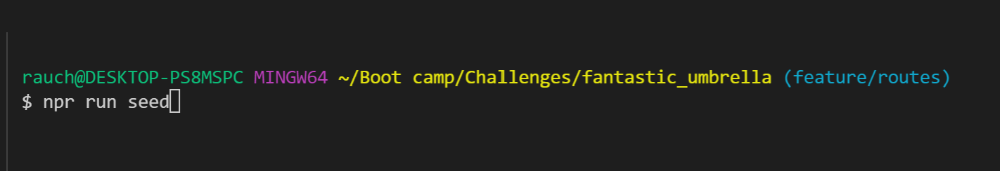

# E Commerce

## Bootcamp: Challenge 13 - Create app to generate a database to view, add, modify categories, products and tags

The purpose of this assignment, is to create a working CLI app for a user to create an e-commerce database, with tables for products, categories and tags

- Motivation: Test what has been learned through practical application and testing of Mysql, Javascript, CLI, OOP, TDD, Node and Node modules including "inquirer", with an emphasis on using "sequelize" to build a database.

- Project: Create an app to create a Ecommerce database from CLI.  The user will be able to view and add categories, products and tags.

- Problem Solved: Once the app is started from the CLI, and the database initialized, in Insomnia, the user can select api/categories products or tags, and view, create, update or deleted this data from the database.

- Lessons Learned: Creating datbases notches up the level of complexity learned.  Correctly flowing the data from the databases, in conjunction with bringing in questions using inquirer has been challenging.  Having trouble correctly setting up the routes to view, add, delete or update the data.  Currently, the app is not working, however the structure has been created.

## Folders and Files

- README.md:  Explains usage and functionality of this app

- /db: Contains info related to the database and tables definitions
 
- /models: Folder where tables are defined, and associations between the data in the databases are created
- gitignore: Contains files names that are not passed to Github for usage with the app

- /routes - Routes for categories, products and tags

- /seeds - Preformatted data that "seeds" the databases for testing

- package-lock.json: Package of Node modules, including "inquirer"

- package.json:  Node module file

- server.js: This is where the app begins.  It calls questionsStart.js, where he user decides which action to take.  The response is returned to app.js, where the response is handled using switch/case, to call the specific function related to the response from the queries.js file.

## How to use this app (it is suggested to have 2 separate command line windows, as well as run an app like Insomnia)

- Command Line - Run the command "npm run seed", which load the data base with data for testing.  

The command line interface should successful loading the databases. 

- Mysql - User needs to connect to the database in the "db/schema.sql" file, and select "ecommerce_db" as the database.  Then run the command "source db/schema.sql", then "use ecommerce_db".  This will activate the database

## GitHub repository...
https://github.com/RauchDavis13/fantastic_umbrella.git

## Video
https://watch.screencastify.com/v/xJI7vgM2f1isjfx218Lh

## Thank you's
Matthew Kim(Instructor)
Valeria Flores(TA)
Dustin Erwin (TA)
Kris Renaldi (TA)
Sandra Smith (Tutor)

